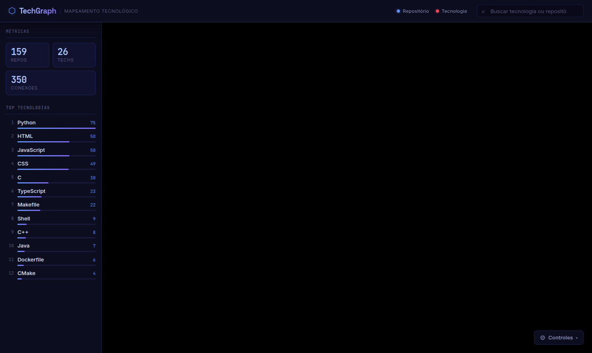
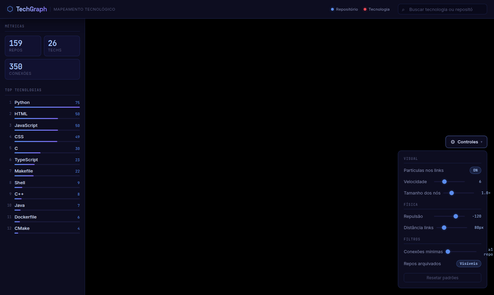
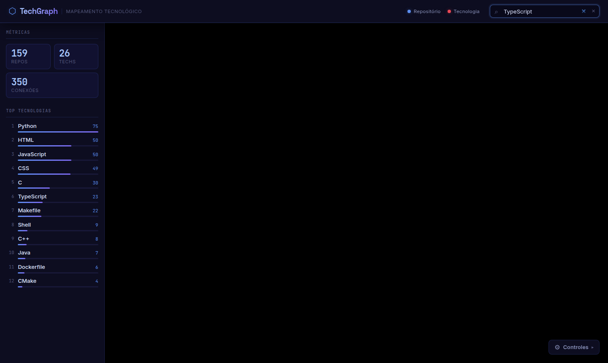

# TechGraph

Número da Lista: 2<br>
Conteúdo da Disciplina: Grafos Bipartidos<br>

## Alunos
| Matrícula | Aluno |
| -- | -- |
| 23/2037786 | Gustavo da Costa Cintra |
| 21/1030765 | Guilherme Storch de Oliveira |

## Sobre
O **TechGraph** é uma aplicação web que mapeia e visualiza de forma interativa a stack tecnológica de uma organização do GitHub. A solução coleta todos os repositórios da organização via API do GitHub e suas respectivas linguagens de programação, construindo um **Grafo Bipartido** onde:

- **Conjunto U — Repositórios:** cada repositório da organização é um vértice
- **Conjunto V — Tecnologias:** cada linguagem identificada é um vértice
- **Arestas:** conectam um repositório à tecnologia que ele utiliza

O grafo é renderizado em **3D interativo** com física de força (*force-directed*), permitindo rotacionar, dar zoom e arrastar nós. Um painel lateral exibe o ranking das tecnologias mais usadas e métricas gerais. Clicar em qualquer nó abre um painel de detalhes com stars, forks, issues abertas, proporção de linguagens e tópicos do repositório.

## Screenshots

**Dashboard — métricas e ranking de tecnologias**


**Painel de controles — física, visual e filtros**


**Busca — filtrando nós por tecnologia**


## Instalação
**Linguagem:** TypeScript<br>
**Frameworks:** Bun · ElysiaJS (backend) · React + Vite (frontend)<br>

### Pré-requisitos
- [Bun](https://bun.sh/) v1.0 ou superior instalado

### 1. Clonar e instalar dependências
```bash
git clone <url-do-repositorio>
cd G34_Grafos_EDA2-2026.1
bun install
```

### 2. Configurar credenciais do GitHub
```bash
cp backend/.env.example backend/.env
```

Edite `backend/.env`:
```env
GITHUB_TOKEN=ghp_seu_token_aqui
GITHUB_ORG=nome_da_organizacao
PORT=3000
```

> **Como obter o token:** GitHub → Settings → Developer settings → Personal access tokens → Tokens (classic) → escopo `repo` ou apenas leitura pública.

## Uso

### Rodar tudo junto (recomendado)
```bash
bun run dev
```

- Backend: `http://localhost:3000`
- Frontend: `http://localhost:5173`

### Rodar separado
```bash
# Terminal 1
cd backend && bun dev

# Terminal 2
cd frontend && bun dev
```

Acesse `http://localhost:5173` no navegador.

Na primeira carga, o backend busca todos os repositórios e suas linguagens na API do GitHub (pode levar alguns segundos dependendo do tamanho da organização). Os dados ficam em cache por 60 minutos.

### Controles do grafo (botão ⚙ no canto inferior direito)
| Controle | Descrição |
| -- | -- |
| Partículas nos links | Animação de fluxo nas arestas |
| Tamanho dos nós | Escala global dos nós |
| Repulsão | Força de afastamento entre nós |
| Distância dos links | Comprimento das arestas |
| Conexões mínimas | Oculta tecnologias com poucos repos |
| Repos arquivados | Exibe ou oculta repos arquivados |

## Outros

### Estrutura do Monorepo
```
/
├── shared/     # Tipos TypeScript compartilhados (GrafoNode, GrafoLink, GrafoResponse)
├── backend/    # ElysiaJS — coleta GitHub API, monta grafo, cache em memória
└── frontend/   # React + Vite — renderização 3D, dashboard, painel de controles
```

### Endpoint da API
```
GET /api/grafo-tecnologias
```
```json
{
  "nodes": [
    { "id": "repo_api-vendas", "label": "api-vendas", "group": "repositorio", "stars": 12, "forks": 3, ... },
    { "id": "tech_TypeScript", "label": "TypeScript", "group": "tecnologia" }
  ],
  "links": [
    { "source": "repo_api-vendas", "target": "tech_TypeScript" }
  ]
}
```

### Vídeo de apresentação
< # >
